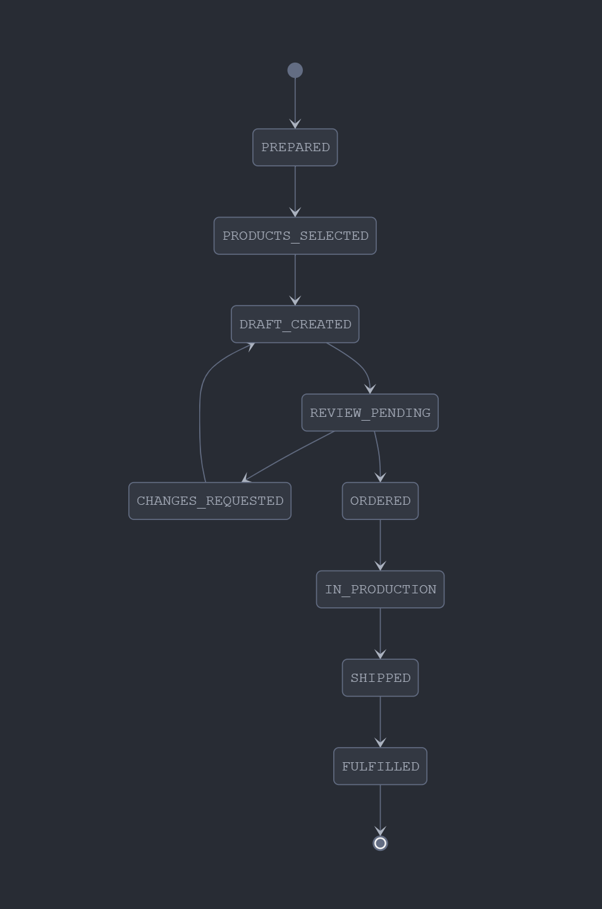

# Getting Started

The YAY Partner API for Photobooks enables you to create photobook projects for your customers and seamlessly integrate with our white-label photobook service.

## SDK
When you use PHP (>= 8.0), please use our SDK available at: https://packagist.org/packages/yay-photobooks/partner-sdk

```composer require yay-photobooks/partner-sdk```

You can use any framework/language that sends HTTP Requests as well.


The API consists of two main components:

1. **Project Management API** - Create photobook projects and provide customer photos for professional layout creation
2. **Webhooks** - Receive real-time updates about your project status and lifecycle events

## Photobook Project Lifecycle

We send webhooks for all significant changes in the photobook project lifecycle, keeping you informed throughout the entire customer journey.

We're happy to walk you through the lifecycle and explain every step in detail. Just contact us.



## Project Flow Overview

### 1. Project Creation (PREPARED)
The photobook project begins when a customer selects photos in your app. Send a `POST /projects` request to create a new project, which moves it to **PREPARED** status. You'll receive:
- A `projectId` for tracking and future API calls
- A `projectReference` for customer communication
- A `redirectUrl` to send your customer to our product selection interface

### 2. Customer Product Selection (PRODUCTS_SELECTED)
Redirect your customer using the returned URL to our customized product selection page. Once they choose their preferred photobook format(s), the project transitions to **PRODUCTS_SELECTED** status.

*Note: While customers can select multiple products in bundles, think of each project as one primary photobook to be printed.*

### 3. Photo Provision
Provide your customer's photos using one of three methods:
- **Immediate**: Include `photoUrls` in the initial project creation request
- **Zip Archive**: Use `POST /projects/{projectId}/provide-photos` with a download URL
- **Individual URLs**: Use `POST /projects/{projectId}/provide-photo-urls` with an array of photo URLs

### 4. Layout Creation (DRAFT_CREATED)
Our layout team creates a professional photobook design using your customer's photos and selected format. When complete, the project moves to **DRAFT_CREATED** status.

### 5. Customer Review (REVIEW_PENDING)
A preview is sent to the customer via email for review. The project status becomes **REVIEW_PENDING** while they evaluate the layout.

### 6. Feedback Loop
The customer can either:
- **Request changes** → **CHANGES_REQUESTED** status → Returns to layout creation
- **Approve the design** → Proceeds to ordering

### 7. Order Placement (ORDERED)
Once the customer approves the layout and completes payment, the project becomes an **ORDERED** status with confirmed purchase.

### 8. Production & Fulfillment
The photobook enters production (**IN_PRODUCTION**), is shipped to the customer (**SHIPPED**), and finally marked as **FULFILLED** when delivery is complete.

## Key Benefits

- **Professional Layouts**: Expert design team creates beautiful photobook layouts
- **Customer Choice**: Multiple product formats and customization options
- **Quality Assurance**: Review and revision process ensures customer satisfaction
- **Full Integration**: Seamless experience that feels native to your platform
- **Real-time Updates**: Webhook notifications keep you informed throughout the process

## Quick Start

1. **Create a project**: `POST /projects` with customer details and photo information
2. **Redirect customer**: Send them to the returned `redirectUrl` for product selection
3. **Provide photos**: Use one of the three photo provision methods
4. **Monitor progress**: Receive webhook notifications for all status changes
5. **Support customer**: Use `projectReference` for customer communication and support

## Authentication

All API requests require HTTP Basic Authentication using your partner credentials. Contact us to set up your account and receive your API credentials.

## Support

Need help getting started? Contact us at [philipp@yaymemories.com](mailto:philipp@yaymemories.com) for:
- Integration consultation
- Technical support
- Custom requirements discussion
